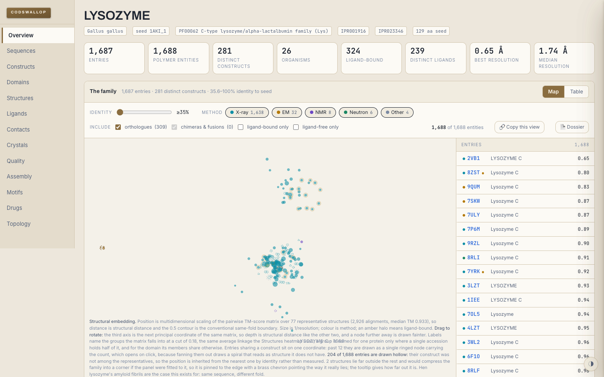

# 🗄️ CODSWALLOP

> **The PDB, summarised: every entry for a protein family, cross-referenced in ninety seconds.**

    

<table>
<tr>
<td>🌐 <b>Website</b></td><td><a href="https://marcdeller.com" target="_blank" rel="noopener noreferrer">marcdeller.com</a></td>
<td>✉️ <b>Contact</b></td><td><a href="mailto:marc@marcdeller.com">marc@marcdeller.com</a></td>
<td>🐙 <b>GitHub</b></td><td><a href="https://github.com/bellcheddar/CODSWALLOP" target="_blank" rel="noopener noreferrer">bellcheddar/CODSWALLOP</a></td>
</tr>
</table>

---

**C**omparative **O**verview of **D**omains, **S**tructures, **W**hole-families, **A**lignments, **L**igands, **L**ineages, **O**rganisms & **P**DB entries.

A structural biologist has just been handed a protein family and told to get up to speed. CODSWALLOP does an afternoon's work of manual PDB trawling in ninety seconds: every entry, every construct, every ligand, every crystallisation condition, cross-referenced and interactive.

**Why it matters:** the RCSB and PDBe landing pages are entry-centric. They answer "what is 4XYZ?" very well, and nobody answers the question a working structural biologist actually asks, which is "what do the 87 structures of this family collectively tell me, and what should I do differently?". CODSWALLOP is family-centric: it treats the family as the unit of analysis, so the answer to "which construct crystallises best" or "which residues has nobody ever put in a construct" is one glance rather than an afternoon of tab-juggling. It is useful for: starting a new target, designing a construct, choosing which deposited structure to trust, planning a crystallisation screen, and writing the structural-biology section of a grant.

Live at **[codswallop.mdeller.com](https://codswallop.mdeller.com)**.

---

## 🧭 What makes it different

| # | Differentiator | Why it matters | Phase |
|---|---|---|---|
| 1 | **Construct diffing** | Aligns every deposited SEQRES against the UniProt canonical to expose tags, fusion partners, truncations, surface-entropy-reduction and thermostabilising mutations. This is what actually gets a crystal, and it is buried in mmCIF nobody reads | 2 |
| 2 | **Global cross-filtering** | One selection state shared by every panel. Click a ligand and the map, the entry list, the crystallisation scatter and the coverage plot all filter together | 1 |
| 3 | **Crystallisation intelligence** | Parses `_exptl_crystal_grow` across the whole family into structured conditions, so you can see what actually worked. Feeds the Top96 crystallisation predictor | 3 |
| 4 | **Coverage census** | Which residues has nobody ever seen? A family-wide map answering a construct-design question in one glance | 1 (constructs), 2 (density) |
| 5 | **Interaction fingerprints** | PLIP run family-wide, so binding-site contacts are comparable across entries rather than one-off | 3 |

## ✨ Features (phases 1 to 3 live, phase 4 landing)

- **Ask for anything.** A PDB ID, a PDB entity id, a UniProt accession, a gene name, a Pfam or InterPro accession, a raw sequence (FASTA or bare), or just what the protein is called. Anything genuinely ambiguous returns a disambiguation card rather than a guess: `4HHB` asks whether you meant the alpha or beta globin, `LYZ` asks which of twelve organisms.
- **One definition of a family.** Whatever you type is resolved to a **seed sequence**, and membership is every PDB polymer entity above a percent-identity threshold to that seed. Every member therefore carries a real identity number to the same reference, so the threshold slider means something exact rather than "whatever the annotation happened to say".
- **The drawer.** An archival shell: a divider rail carrying all ten sections from day one, a family header with a rubber-stamped `FILED` mark, a stat strip, and an index card that flips out from any entry anywhere without ever losing the family context.
- **The constellation.** Every entry as a node. Once the family has an embedding, position is classical MDS of the pairwise TM-score matrix, so distance on the map is *structural* distance and the 0.5 contour is the conventional same-fold boundary; until then it falls back to a clearly-labelled identity layout. Node size is 1/resolution, colour is method, an amber halo means ligand-bound. Labels name the clusters the matrix falls into at the same cut the Structures heatmap uses. A ringed node holds several entries that share a construct and opens on click; a hollow node has a position inherited rather than measured; a brass chevron means the structure lies off the end of the scale and has been pinned to the edge.
- **Cross-highlight.** Hovering any row in the entry list pulses that entry's node brass in the map, and hovering a node highlights its row. One state, two representations, and every panel added in later phases binds to the same shared selection state.
- **Family definition controls.** Percent-identity slider, method chips, and include/exclude toggles for orthologues and for chimeras and fusion constructs. All of it filters client-side and instantly: the family is assembled once at the lowest threshold and every control re-filters the same cached set.
- **Construct coverage census.** How many of the family's constructs contain each residue of the seed, as a depth profile. On lysozyme it finds residues 1 to 18 covered by 66 of 1,686 constructs, which is the signal peptide that is cleaved and never present in the mature protein. On p53 it finds residues 361 to 393 in 10 of 267.
- **Full table view.** Sortable, filterable, column-toggleable, with CSV, JSON and BibTeX export. The BibTeX is deduplicated to one record per paper with the PDB IDs collected in a note, which is the tedious part of assembling a family bibliography by hand.
- **Provenance: what it is called, and who did the work.** Every spelling the family is deposited under, reconciled against UniProt's recommended, alternative, short and gene names, plus the reverse direction that actually breaks a literature search: within hen lysozyme's own family, "Lysozyme C" is the deposited description of **seven different accessions**. Beside it, the depositing groups: last author as the group's proxy (labelled as the convention it is), counted per entry rather than per paper, with a deposition timeline. 380 groups over 1975 to 2026 for lysozyme, the largest holding 8.3 % of it.
- **Conservation on the surface.** ConSurf-style colouring of the loaded structure by family-wide conservation, banded on the family's own quintiles because a family is similar sequences by construction and a fixed scale never uses its variable end. The seed-to-structure frame is *scored on residue identity* rather than assumed, and refused below 60 % agreement, so a construct with an N-terminal tag is not frame-shifted into a plausible-looking lie.
- **A JSON API other projects can build against.** `/api/v1/family/<slug>` is a few kilobytes with field names that are a promise and a `schema_version` to break if one has to change meaning, rather than the front end's own multi-megabyte payload.
- **Dark by default, light on request.** A lamp-lit archive theme that honours `prefers-color-scheme` and respects `prefers-reduced-motion`, self-hosted type, and no third-party request on any page load.

## 🔬 Worked example: a fold nobody searched for

Search `1AKI`, hen egg-white lysozyme. It is the most-solved protein in the archive: 1,687 entries, 281 distinct constructs, 26 organisms, and essentially all of it is the same fold solved again. The embedding says so, putting 1,686 of the 1,688 entities in one cloud.

Two are not in it.



They are **9J0L** and **9J0M**, cryo-EM structures of hen lysozyme **amyloid fibrils**, and they sit at the far edge with a brass chevron because they are off the end of the scale entirely.

| | 9J0L and 9J0M |
|---|---|
| Identity to the seed | **100%** (identical sequence, and the same construct as each other) |
| TM-score to the other 76 representatives | min 0.15, **median 0.18**, max 0.20 |
| Pairs above the 0.5 same-fold line | **0 of 76** |
| Method | cryo-EM at 2.29 Å and 3.21 Å |

Same protein, same sequence, a completely different fold: native lysozyme refolded into a cross-β fibril. **No sequence-based view of this family can find them**, because there is nothing in the sequence to find. They are 100% identical to the seed, so an identity slider puts them at the top of the list along with everything else, and the identity layout the map falls back to places them in the middle of the crowd. Only a structural distance separates them, and only a family-centric one makes it obvious that it is two entries out of 1,688 rather than a general property of lysozyme.

### What the map is not

Two limits worth stating, because a scatter plot of points looks like a measurement whatever produced it.

**It is a shadow, not the thing.** The map is two dimensions of an object that has as many as the family has representatives. Across the 70 built families the first two principal coordinates carry a median of **65%** of the positive eigenvalue mass, and as little as **33%** (the beta-2 adrenergic receptor, tau, insulin, calmodulin). Two structures drawn close together are close in the projection; on a low-variance family they may be further apart than they look. The heatmap in the Structures panel is the higher-fidelity view of the same matrix, which is why both exist.

**1 &minus; TM is not a Euclidean distance**, so the Gram matrix has negative eigenvalues: a median of **19%** of the positive mass, up to **49%**. They are clamped to zero rather than the build failing, which is the standard treatment and is honest as far as it goes, but it means the embedding is an approximation of a geometry that does not strictly exist. Reading distance qualitatively (near, far, off on its own) is safe. Reading it as a metric is not, and there is nothing on the panel to stop you: use the TM-score matrix itself for anything quantitative.

This is also why the panel is fitted the way it is. Those two points sit at x = -1.0 while every other representative spans -0.036 to +0.046, so fitting the panel to the furthest point put the entire native family inside 5.4% of its width: a map of one curiosity and a smudge. The fit uses a high quantile with headroom instead, and pins anything beyond it to the rim with its true distance in the tooltip, so the outlier stays visible and stays findable without costing the other 1,686 structures their map.

## 🧱 Stack

| Layer | Choice | Note |
|---|---|---|
| Backend | Python 3.11, Flask, gunicorn | No compiled toolchain needed on the droplet in phase 1 |
| Cache | SQLite (WAL) | Raw API responses plus assembled families, both with a one-week TTL |
| Front end | Vanilla JS, hand-rolled SVG | The map needs direct control of individual nodes for the cross-highlight pulse |
| Tables | Tabulator 6.3.1 | Vendored, skinned to the theme tokens |
| Type | Archivo, Inter, JetBrains Mono | Self-hosted woff2, latin and latin-ext only, 244 kB total |
| Serving | nginx, certbot | Same droplet pattern as AlphaFraud |

## 📡 Data sources

All public, none require a key. Please cite them, not this tool, when the data does the work.

| Source | Endpoint | Used for |
|---|---|---|
| RCSB Search API v2 | `search.rcsb.org/rcsbsearch/v2/query` | Family resolution: sequence (mmseqs2), UniProt accession, Pfam/InterPro annotation, full text |
| RCSB Data API | `data.rcsb.org/graphql` | Batched entry, polymer entity, assembly and chem_comp metadata |
| UniProt REST | `rest.uniprot.org/` | Canonical sequence, protein name, organism, gene names |
| InterPro API | `ebi.ac.uk/interpro/api/` | Pfam and InterPro accession names and types |

Phases 2 to 4 add the RCSB 1D Coordinates, Alignment and file services, the PDBe REST and Graph APIs, EMDB and the AlphaFold DB.

## 🧪 Tests

```bash
./.venv/bin/pip install pytest
./.venv/bin/python -m pytest
```

183 tests, none of which touch the network. They are written against the bugs that actually shipped rather than for coverage: a fusion partner being shredded by the aligner, a chimera diffed against the wrong reference, `Bis-Tris` being tallied as `Tris`, a saturating "never" statistic, a cached `None` being refetched forever, a beacon that no page requested, a family outvoting its own subject, a disulphide bond expanded into 122 of them, a decorative spiral that read as structure, a cluster labeller whose preferred input was empty on every real request, an offset applied twice so that contacts landed on residues the protein does not have, and a gene search that answered VEGFR with twelve fruit flies.

## 🔧 Installation

```bash
git clone https://github.com/bellcheddar/CODSWALLOP.git
cd CODSWALLOP
python3 -m venv .venv
./.venv/bin/pip install -r requirements.txt
./.venv/bin/python CODSWALLOP.py init
```

## 🚀 Usage

```bash
# Run the development server (defaults to 127.0.0.1:8006)
./.venv/bin/python CODSWALLOP.py serve

# Assemble a family from the shell, without a browser
./.venv/bin/python CODSWALLOP.py build P00918
./.venv/bin/python CODSWALLOP.py build "TEM-1 beta-lactamase"
./.venv/bin/python CODSWALLOP.py build PF00062 --refresh

# Cache housekeeping
./.venv/bin/python CODSWALLOP.py stats
./.venv/bin/python CODSWALLOP.py purge
```

| Command | Does |
|---|---|
| `init` | Create the cache database and apply any column migrations |
| `serve` | Run the development server (`--bind`, `--debug`) |
| `build <query>` | Assemble a family and print a summary. Exits 2 with a candidate list if the query is ambiguous |
| `stats` | Cache statistics: families, entries, entities, cached responses, database size |
| `purge` | Drop expired cache entries |

### Routes

| Route | Does |
|---|---|
| `/` | The closed drawer: one search field |
| `/lookup?q=` | Resolve the input, then redirect to the family or ask which one you meant |
| `/f/<slug>` | The family. Paints complete if cached, paints its filing state and fetches if not |
| `/f/<slug>/dossier` | A self-contained family report: one file, no fetches, prints to PDF |
| `/api/family/<slug>` | Assemble (or serve) a family as JSON. The front end's own payload, not a contract |
| `/api/v1/families` | What this instance has filed. The entry point for another program |
| `/api/v1/family/<slug>` | **The stable summary.** A few kilobytes, versioned schema, CORS open. Never assembles on demand |
| `/api/stats` | Cache statistics, and the per-app hit beacon for the mdeller.com launcher |
| `/healthz` | Liveness |

## 🛠️ Configuration

Copy `.env.example` to `.env`. Everything has a sensible default in `codswallop/config.py`.

| Variable | Default | Does |
|---|---|---|
| `DROPLET_SSH` | | SSH destination for `deploy/deploy.sh` |
| `DROPLET_PATH` | `/opt/codswallop` | Where the code lives on the droplet |
| `SERVER_NAME` | `codswallop.mdeller.com` | Hostname certbot issues a certificate for |
| `BIND_ADDR` | `127.0.0.1:8006` | Address gunicorn binds to (8000 to 8005 are taken by the sibling apps) |
| `CACHE_TTL_HOURS` | `168` | How long a cached API response stays fresh |
| `FAMILY_TTL_HOURS` | `168` | How long an assembled family stays fresh |
| `MAX_FAMILY_ENTITIES` | `2500` | Cap on entities pulled into one family |

The two TTLs default to a week because the PDB releases weekly: a family cannot gain a member mid-week.

## 📊 Performance

Measured on carbonic anhydrase II (`P00918`), 1,490 entries, and lysozyme (`P00698`), 1,686 entries.

| Path | Cost |
|---|---|
| Cold family assembly | 7 to 12 s (one sequence search plus 30 batched GraphQL calls) |
| Warm family, served from SQLite | 0.07 s |
| Assembled family payload | ~1.7 MB JSON, ~240 kB gzipped |

The payload is deduplicated before it goes over the wire: sequences, primary citations, chemical components and domain annotations all move to family-level lookup tables, because a family is mostly the same construct solved again. Carbonic anhydrase II has 1,490 entities and 232 distinct sequences. Doing this took the page from 6.3 MB to 1.8 MB.

## 🎨 Theme tokens

Anything physical is brass (drawer front, dividers, plate, pins, stamps); all data is cool. That rule is what holds the theme together.

| Token | Dark | Light | Role |
|---|---|---|---|
| `--bg` | `#131924` | `#EDE7DC` | Room |
| `--bg-2` | `#182031` | `#E4DCCC` | Drawer interior, rail |
| `--sky` | `#0F1522` | `#F4F1E9` | Constellation field |
| `--surface` | `#1F2938` | `#FCFAF5` | Cards, panels |
| `--surface-2` | `#273346` | `#F1ECE0` | Raised, panel headers |
| `--line` | `#2E3A4E` | `#D3C7B0` | Borders |
| `--text` | `#E4EAF6` | `#1D2430` | Type |
| `--dim` | `#93A2BC` | `#55627A` | Secondary type |
| `--mute` | `#65748E` | `#7C8AA3` | Tertiary type |
| `--brass` | `#C9A063` | `#8A6D40` | Anything physical |
| `--brass-dk` | `#8A6D40` | `#6B5330` | Anything physical, shaded |
| `--on-brass` | `#1A1408` | `#FDF8EE` | Ink sitting on brass |
| `--accent` | `#5B8CFF` | `#1F5FD8` | Brand blue |
| `--cyan` | `#4FD1E3` | `#0F8FA6` | X-ray |
| `--amber` | `#F5B93F` | `#B47908` | Cryo-EM, ligand halo |
| `--violet` | `#9B7BE8` | `#6B47C4` | NMR |
| `--oxide` | `#E0685C` | `#B8382C` | FILED stamp, warnings, disorder flags |
| `--mint` | `#43C79F` | `#1B8763` | Neutron, pass states |

## 🌐 Deployment

Mirrors the AlphaFraud pattern exactly.

```bash
bash deploy/deploy.sh                                    # from your Mac, after the first provision
sudo SERVER_NAME=codswallop.mdeller.com bash /opt/codswallop/deploy/provision.sh   # once, on the droplet
```

`provision.sh` is idempotent: system packages, service user, venv, systemd unit, nginx site, Let's Encrypt certificate, and the HTTP/2 patch that certbot does not apply on nginx 1.24.

**The droplet builds every artefact itself.** There is no second machine and nothing to push: `deploy/worker.sh` drains the request queue on a fifteen-minute timer, one family at a time, `nice`d so a reader waiting on a page always wins. Compute dependencies are in `requirements-compute.txt` and install as prebuilt wheels, so the box needs no compiler.

```bash
systemctl status codswallop-worker.timer        # is it armed
systemctl start codswallop-worker.service       # force a pass now
tail -f /var/log/codswallop-worker.log          # what it is doing
```

## ✅ To Do

Roadmap for CODSWALLOP, in dependency order: each phase is independently shippable, and the divider rail carries every phase's section from day one so navigation never needs rebuilding. Suggestions welcome.

### Phase 1: spine (shipped)

- [x] **Flask skeleton, deploy pattern and port allocation.** Blueprint layout, gunicorn config, systemd unit, nginx vhost with the post-certbot HTTP/2 patch and the shared long-cache snippet. Port 8006, because 8000 to 8005 are taken by AlphaFraud, ChemSage, ChatPDB, BoltzMaker, FlexAppeal and PANTS
- [x] **SQLite cache with a family/entry/entity schema and a TTL.** Two layers: raw API responses keyed by the request itself, and assembled families. Second query for a family is 0.07 s against 7 to 12 s cold
- [x] **Cache keys carry a parse version.** Because searches are cached in *parsed* form, adding a field to the parser leaves it absent from every cached row and the consuming code fails silently. Adding the alignment spans without bumping it left the coverage figure reading 100 % and the fusion count reading 0, both of which look like answers rather than missing inputs
- [x] **Column migrations, not just `CREATE TABLE IF NOT EXISTS`.** Which silently does nothing to a table that already exists, so a new column reads back NULL on any deployed instance and the app computes a plausible wrong answer
- [x] **Family resolver accepting seven input kinds.** PDB ID, PDB entity id, UniProt accession, gene name, Pfam/InterPro accession, raw sequence, free text. Ambiguous input returns a disambiguation card, never a guess
- [x] **One definition of family membership.** Every input resolves to a seed sequence and membership is a percent-identity threshold against it, so the slider is exact rather than annotation-dependent. Where the *seed* rather than the input is a choice (which member represents a Pfam family), it is picked by a stated rule and the header says which and why
- [x] **Batched GraphQL fetch of core metadata.** Fifty entities per round trip, each batch cached independently so overlapping families share what they have in common
- [x] **R-factor fallback chain.** `_refine.ls_R_factor_R_work` is the field everyone quotes and a good fraction of the archive leaves it empty, putting the number in `ls_R_factor_obs` or `ls_R_factor_all` instead. Reading only the obvious field showed a blank R-work beside a populated R-free on 82 of 1,473 carbonic anhydrase II X-ray entities
- [x] **The drawer shell, complete.** Divider rail with phase pips, family header with the FILED stamp, stat strip, slide-over index card, dark and light token sets. Built once so later phases only add panels
- [x] **Hero map with a placeholder layout.** Positions come from the server so the map, table and any future export agree on one set of coordinates. The radial axis is identity *rank*, not raw identity: a family whose members are 95 % near-identical piles onto one circle under a linear map, which is exactly what the first version drew
- [x] **Cross-highlight wired.** One shared selection state, and every panel reads it. This is the element the interface is remembered by and the thing later phases must bind to rather than reinventing
- [x] **Construct coverage census as a depth profile, not a binary union.** The union answers "has anyone ever put this residue in a construct", which for any well-studied protein is yes everywhere: 140 of the 1,992 spike entities carry the full 1,273 residues, so the union reports perfect coverage for a protein whose cytoplasmic tail is essentially never studied. The depth profile says the useful thing instead
- [x] **Full table view with CSV, JSON and BibTeX export.** BibTeX deduplicated to one record per paper with the PDB IDs collected in a note
- [x] **Payload deduplication.** Sequences, citations, chemical components and domain annotations moved to family-level lookups: 6.3 MB to 1.8 MB, ~240 kB gzipped
- [x] **Mobile responsive and `prefers-reduced-motion` respected**, at this phase rather than retrofitted
- [x] **Deployed to codswallop.mdeller.com** and listed at the top of `mdeller-landing/apps.json`. The beacon is `/api/stats`, and it needed the footer's "filed so far" line to exist first: the beacon was declared before anything on any page requested it, which would have left the launcher's hit count reading zero forever with nothing to show why. A static asset would have been the easier beacon and a worse one, since `/static/` is served `immutable` and a returning reader never re-requests it

### Phase 2: sequence, construct and domain intelligence

- [x] **Fetch the UniProt canonical and every deposited SEQRES.** Plus UniProt active and binding sites, used only to *describe* a mutation ("at an annotated active site"), never to claim what it did
- [x] **Family alignment with per-column conservation and a sequence logo.** A star alignment against the seed rather than a progressive MSA, so a column here is the same column as in the coverage census and the domain ribbon, and no external binary is needed on the droplet. Conservation is normalised Shannon entropy weighted by how many entities used each construct. It also produces the list this panel exists for: **positions people deliberately mutate**, where the wild type still dominates but a real minority carries something else. On p53 the top of that list is M133L, V203A, N239Y and N268D, which together are the thermostabilising superstable quadruple mutant, alongside the Y220C druggable hotspot; on carbonic anhydrase II it is the active-site pocket variants
- [x] **Construct diff engine.** The flagship, and it works: Align every SEQRES to the canonical and classify: N- and C-terminal expression tags (His6/8/10, Strep-II, FLAG, HA, Myc, Avi), cleavage sites and scar residues (TEV, 3C/PreScission, thrombin, SUMO, enterokinase), fusion partners (MBP, GST, SUMO, Trx, T4 lysozyme, BRIL, rubredoxin, PGS, GFP), truncations and internal loop deletions, point mutations sub-classified as catalytic, thermostabilising, surface entropy reduction or disulphide engineering, and non-canonical residues including SeMet
- [x] **Replaced the phase 1 fusion heuristic**, which was wrong on every case it flagged for carbonic anhydrase II: all four were *Schistosoma* CA, a genuinely larger protein with a His6 tag, called a fusion only because it was measured against the human seed rather than its own reference
- [x] **Construct table.** One row per unique construct, most-used first, with the entries that used it and their best resolution. On p53 the top row is residues 94-312 carrying M133L/V203A/Y220C at 1.24 Å, and R273H, R249S and R282W each get their best structure: "which construct crystallises best" answered directly
- [x] **Domain and fold annotation.** CATH, SCOP2B and ECOD per chain from the RCSB instance features, aggregated to a consensus with median boundaries and a chain count, drawn as an architecture ribbon. A domain must appear on at least 2 chains (or 1 % of them) to be reported: without that the list filled with domains belonging to *other* proteins in the complexes, and p53 picked up "Green fluorescent protein" and "Annexin"
- [x] **Density coverage census.** `UNOBSERVED_RESIDUE_XYZ` per chain, mapped through each member's own alignment offset onto seed coordinates, drawn as a second curve against the construct curve. "Resolved in no construct at all" turned out to be as useless a bar as the binary union (0 % for p53), so the reported figure is the *ratio*: residues resolved in under a quarter of the constructs that contained them. p53 reads 20.6 %, and names 361-393, 62-90 and 294-312; spike's 1152-1271 is resolved in 4 %; carbonic anhydrase II is 0.8 %
- [x] **Cross-species orthologue matrix.** Organisms by entry count, with best resolution, holo count and the fraction of the seed each one's constructs cover
- [x] **Bound the construct table to the shared selection state.** Hovering a construct dims every node on the map that does not use it, and clicking opens the best entry that did, so a reader lands on a real structure rather than an abstraction

### Phase 3: structure, chemistry and interactions

- [x] **Mol\* viewer embedded, single entry.** From the index card and from a Structures panel with an entry picker that follows the current filters. Loaded **on demand**, because Mol\* is 5 MB, larger than the whole rest of the page including a 1,500-entry family payload: somebody who came for the construct table should not pay for a renderer they never open. It reads structures straight from the RCSB, so this needs no downloads, no storage and no toolchain on the server, which is what let it ship separately from the pipeline work below. Viewport colour follows the theme toggle
- [x] **Family superposition, and an AlphaFold overlay with pLDDT colouring.** The transforms fall out of the same TM-align run that builds the matrix. The reference is the representative most similar to everything else *among the seed's own structures*, not the best-resolution one: superposing onto an outlier makes every other structure look wrong, and it is forced into the loaded set because every transform maps onto its frame. Restricting it to the seed is not fussiness. A family is assembled at 30 % identity, so an ABL1 search legitimately returns most of the tyrosine kinases, and the most central structure of that set is an EGFR entry: the page superposed ABL1's family onto a different protein, with nothing on it saying so. The AlphaFold model **is** superposed, onto the same reference as everything else: the alignment is the same TM-align call, done in the pipeline where TM-align lives rather than in a browser that cannot do it, and the panel reports the TM-score so an overlay of something that does not actually superpose is visible as such. Its URL comes from the AFDB API rather than being constructed: this was written against `-model_v4.cif` and the DB already serves v6. The accession it fetches is the family's *seed*, never the accession the most members carry, which is a popularity contest the subject frequently loses: ABL1 and JAK1 both fetched EGFR's model, and every A2A receptor structure carries a BRIL fusion, so A2A fetched the model of *E. coli* cytochrome b562. Both rendered as a confident superposition of the wrong protein at a TM-score that looked merely poor rather than meaningless.
- [x] **Pairwise TM-score matrix, and the embedding it produces.** The placeholder layout is retired for any family that has one: node positions are classical MDS of the 1&nbsp;&minus;&nbsp;TM distance matrix, so distance on the map is structural distance and the 0.5 contour is the conventional same-fold boundary. Computed **on a workstation, never on the droplet** (`CODSWALLOP.py embed`, then `deploy/push_embeddings.sh`): it downloads mmCIF files and does real numerical work, and the box has two cores shared with eight apps. `tmtools` and `biotite` are in `requirements-dev.txt` only, and the app reads a JSON artefact through a reader that imports nothing beyond the standard library. (numpy is on the droplet regardless, as a biopython dependency: it is the mmCIF parsing and TM-align that stay off it.) One representative per distinct construct rather than per entry, capped, because superposing two crystal forms of an identical construct measures crystallography rather than biology. Half the cap is reserved for constructs of the protein that was actually searched for, topped up only where ranking by usage would leave it under-represented, so a family whose seed is dominant keeps exactly the nodes it had. Without the reservation an ABL1 search put 2 of its 80 nodes on ABL1, and both were its 63-residue SH3 domain: the map, the reference and the AlphaFold model were all EGFR's. It is now 40 of 80 at a median length of 270, which is the kinase domain *(Superseded below: the workstation-only rule fell to per-chain fetching, and the droplet computes this itself now. `requirements-compute.txt`, not `requirements-dev.txt`.)*
- [x] **The matrix as a clustered heatmap, with its clusters as filters.** Average linkage in the browser, so the cut height is a live control: dragging it is the only way to tell whether a grouping is real or an artefact of where the line sits. Drawn on a canvas, because a 260-representative family is 67,600 cells. The default cut is 0.18, not the conventional 0.5 same-fold line, which returns one cluster for almost any family because every member of a family is the same fold by construction. Picking a cluster narrows the map, the entry list, the table and every other panel through the shared selection state.
- [x] **Ligand panel.** CCD ID, formula, SMILES, occurrence count and best resolution achieved, with a per-component classification into ligand, cofactor, lipid/detergent, ion, buffer, cryoprotectant or solvent. This retires the Phase 1 exclusion list: "ligand-bound" now means a ligand or a cofactor, which took carbonic anhydrase II from 1,208 entities to 1,096 and the receptor from 409 to 395. Each component carries the RCSB's own 2D depiction, fetched lazily because a family can hold hundreds. Whether a metal is structural or catalytic is a property of the protein and not of the component, so this began by filing carbonic anhydrase's catalytic zinc as an ion and saying so on the panel. It is now resolved with evidence rather than by declaring it unresolvable: a metal is promoted to cofactor when the interaction data shows it coordinated by at least 3 residues that are conserved above 0.90, across at least 5 entries, and the promotion states which residues did it. The entry threshold is doing real work, since a single mercury on one entry qualified on every other test
- [x] **PLIP family-wide.** A hot-residue ranking with each residue's conservation beside it, and a ligand-by-residue fingerprint heatmap, in seed coordinates so a hot residue is the same residue as in the conservation track and the domain ribbon. Workstation only, like the embedding. The conversion reuses Marc's `cif2plip.py` verbatim (vendored to `pipeline/`) for its `pdb_tidy` CONECT serial-gap fix; only the PLIP invocation differs, asking for XML rather than the PyMOL session and images a web page cannot use. Validated on carbonic anhydrase II: 890 contacts over 40 entries with no conversion failures, and the top residues come out as His96, Thr199, Thr200, Leu198, His94 and His119, which is the zinc triad and the gatekeeper threonines, found with no prior knowledge of the enzyme anywhere in the pipeline.
- [x] **Crystallisation panel.** `_exptl_crystal_grow.pdbx_details` is free text a depositor typed, so this is a parser, not a field read: 17 precipitant patterns, 15 buffers with their working pH ranges, 14 additives and 9 setup methods, each carrying the best resolution anyone achieved with it. On the beta-2 adrenergic receptor it finds lipidic cubic phase in 79 of 120 conditions with monoolein and cholesterol as the top additives, which is exactly how that receptor is crystallised. CSV export for TopPDBLX
- [x] **Quality and validation panel.** Clashscore, RSRZ, Ramachandran and rotamer outliers, R-free minus R-work gap, data completeness and structure-factor availability, as a traffic light against the wwPDB report's own thresholds, worst first, with the family's medians for context. The figures live in `pdbx_vrpt_summary_geometry` and `pdbx_vrpt_summary_diffraction`; `pdbx_vrpt_summary` itself holds almost nothing

### Phase 4: topology, export and polish

- [x] **The two machines stay in step by themselves.** They hold different halves of the same app and neither can do the other's job: the droplet is the only one that knows what readers have asked for, because families they assemble live in a cache database deliberately excluded from every rsync, and the workstation is the only one that can build an embedding, a fingerprint or a topology. So the family set has to travel one way and the artefacts the other, and until `deploy/sync.sh` neither happened on its own: the droplet held 13 families, the workstation 34, and the landing page showed a third of the archive. The sync is keyed on the **query** rather than the slug, because a slug is derived from the seed and moves when a protein is renamed upstream, while the query is what a person actually typed and is the only thing either machine can rebuild from. Run daily from launchd rather than cron, since this Mac is usually asleep at four in the morning and `StartCalendarInterval` runs at the next wake where a cron entry simply misses it, twenty minutes behind the droplet's own warm so it reads a settled list *(Superseded below: there is no longer a second machine to stay in step with, and `deploy/sync.sh` with its launchd timer is deleted.)*
- [x] **Artefacts for families a reader creates, not just ones somebody pre-warmed.** The embedding and the interaction fingerprint are built on a workstation and rsynced across, because the droplet has two cores shared with eight apps and deliberately has neither biotite, tmtools, PLIP nor OpenBabel installed. So a family assembled for the first time by a reader on the live site had an artefact on neither machine and rendered the identity placeholder indefinitely, since nothing outside a hand-written pre-warm list ever asked for it. The droplet now records the request (`artefact_request`, keyed on slug, counting hits so the queue is a priority order rather than a log) and `deploy/drain_queue.sh` collects from the workstation: read the queue over SSH, build, push, and only then mark each one served, because marking on build completion empties the queue on a failed push, which is the one state where the record matters most. A family that later needs *more* than it was served, which is what a pipeline version bump does to every family at once, returns to the queue rather than staying quietly marked done. The map's own note was the other half: it said "run `CODSWALLOP.py embed` on a workstation", which is advice for the one reader who is me, and now states plainly that the layout is not a structural measurement, why it cannot be computed while you wait, and that the family has been queued *(Superseded below: there is no second machine to collect from, so the queue is drained in place by `deploy/worker.sh`.)*
- [x] **Topology diagrams from DSSP as custom SVG.** Strands as arrows, helices as cylinders, built in-house rather than scraped from PDBsum, which is copyrighted. Drawn on the **seed axis**, so an element sits directly under the same residues as the conservation track, the coverage census, the domain ribbon and the motifs tab, and mapped there by **alignment rather than by an assumed offset**: an entry may be numbered on the mature protein, on the construct from 1, or on the canonical, and an assumed offset is right often enough to look like it works. The connectivity is the part worth having and the part a linear track cannot express: the arcs are **DSSP's bridge partners**, so they show which strands actually hydrogen-bond to which, weighted by how many bridges support each pair so one spurious bridge does not draw the same line as a ten-residue pairing. GFP comes out as eleven strands with the long-range arc that closes the barrel; KRAS as the six-stranded mixed sheet of a G domain; myoglobin, haemoglobin and ferritin as all-helical with no arcs at all. DSSP proper when `mkdssp` is on the PATH (CCP4 ships it) and biotite's P-SEA otherwise, with the artefact recording which, because the two disagree at element boundaries and P-SEA has no bridge partners to give: the pairing is then absent rather than guessed
- [x] **Motifs tab (first half: sequence sites, grounded in the family).** Functional sites on the seed in one place, from **UniProt's curated features** (active and binding sites, modified residues, glycosylation, lipidation, disulphides, transmembrane spans, signal peptides, short linear motifs) and from **PROSITE** signatures via ScanProsite. The panel says which is which and does not mix them, because they are different claims: a UniProt feature is somebody having read a paper about this protein, a PROSITE hit is a pattern having matched a string. The **high-probability PROSITE patterns are excluded by default**, and that single flag is most of the value here: scanning chicken lysozyme with them on returns a PKC phosphorylation site and two N-myristoylation sites, on a secreted protein that has none of them. Six hits become two, and the two are the lysozyme-like domain profile and the glycosyl hydrolase family 22 signature. Every site carries **the share of the family whose construct contains it and how often it is actually resolved when present**, which is what makes it a family panel rather than a sequence-annotation panel: lysozyme's signal peptide is in 4.0 % of constructs and resolved in 0.7 %, because it is cleaved, and no single entry's page can tell you that. "Resolved" is expressed against the constructs that contained the site, so a site nobody has ever cloned reads as unknown rather than as disordered. It also found a real bug in the feature parser: UniProt gives a disulphide as its two paired cysteines, and expanding that to a range turned lysozyme's 24&ndash;145 bond into 122 consecutive "disulphide bonds", one per residue
- [x] **Family-specific reference numbering in the motifs tab**, following what BoltzMaker does. **KLIFS** for kinases and **GPCRdb** for receptors, used differently because the two are shaped differently. GPCRdb returns per-residue generic numbering keyed on the **UniProt sequence number**, so it lands directly in seed coordinates beside the conservation track and the coverage census: A2A's DRY, CWxP, NPxxY and PIF micro-switches are located by generic number rather than by sequence, which is the entire point of a generic scheme, so a receptor whose DRY is a DRF still has its switch found and shown as DRF. The full segment map (TM1&ndash;TM7, the loops, H8, C-term) comes with it. KLIFS numbers its 85-residue pocket against each deposited structure's own author numbering, which is not the seed's, so rather than guess a mapping this reports the thing KLIFS alone can say about a *family*: **which conformation each of its structures was caught in**. ABL1 is 43.0 % DFG-out, 31.6 % out-like and 25.3 % DFG-in across the 158 of its entries KLIFS holds, with the &alpha;C-helix in on 95.6 %. A single entry's page can tell you it is DFG-out; only the family can tell you what fraction of the field that is. A family that is neither gets neither, rather than an empty kinase pocket for a lysozyme. Licences: GPCRdb releases its data CC BY and KLIFS is free for academic use, both attributed on the panel
- [x] **Assembly and oligomeric state panel.** The family-level question a single entry page cannot answer: has a protein deposited 1,686 times ever been seen as anything other than the state everyone quotes? Lysozyme is 90.9 % monomeric, and the 4.3 % dimeric and 4.0 % trimeric entries are exactly the ones worth opening. Provenance is reported as three counts and deliberately **not** as an agreement rate, because `author_defined_assembly` says only that the depositor stated one: PISA may have returned nothing or never run. Scoring that as disagreement would have invented a conflict on 758 of those 1,686 entries. The ambiguity that is real, an entry whose own assemblies disagree about the chain count, is 19 of them, and they are listed by name rather than reduced to a rate. Two things the data forced: oligomeric states group on the **chain count**, never on `oligomeric_details`, whose capitalisation is not consistent across the archive and which listed "trimeric" (64) and "Trimeric" (3) as two different states in the same table; and buried interface area is quoted as quartiles rather than a range, because one 24-mer puts the maximum three orders of magnitude above the median (1,476 Ų against 615,514 Ų)
- [x] **The dossier becomes the reference document it was meant to be.** Every figure the app draws, drawn again for a file that fetches nothing: domain architecture and construct coverage as inline SVG, the RCSB's own ligand depictions and a rendered still of the reference structure embedded as `data:` URIs, and the seed sequence numbered every ten with sites, PTMs, disulphides, transmembrane spans and the fifteen most-substituted positions marked. KPIs on one row, each linking into the live app, and a cross-reference bar out to UniProt, RCSB, PDBe, PDBe-KB, AlphaFold, InterPro, Pfam, CATH and SCOP, the last two by the identifiers the Domains panel already holds rather than by a search. The self-containment test was corrected while doing it: it forbade `/dossier`: one file, branded, suitable for a project kickoff or a grant appendix. Constructs, the positions people deliberately mutate, assembly, domains, ligands, crystallisation, validation, orthologues, the seed sequence and one record per primary paper. Self-contained in the strict sense and tested for it, because the point of the thing is to outlive the session it came from: no script, no stylesheet, no font, no image and no `url()` anywhere, so it still works opened from a mailbox years later with nothing behind it. PDF is the browser's own print-to-PDF rather than a server-side renderer, which keeps WeasyPrint and its Cairo stack off a droplet with two cores, and the print CSS earns that choice: `@page` margins, no row split across a page break, no heading stranded at a page foot. It renders from a family that is already filed and never assembles one on demand, since assembly takes up to ninety seconds and this is exactly the URL a link checker fetches. Two things it taught: an undated paper crashed Jinja's `sort` filter comparing `None` to `int`, so citations are ordered in Python; and the line reporting "1,606 carry a deliberate mutation" was wrong, because `is_engineered` means *differs from the UniProt canonical* and lysozyme's most-used construct is the mature protein after its signal peptide, so the document now says which it means and points at the construct column instead
- [x] **Shareable permalinks with the filter state encoded in the URL.** What a reader is looking at is a filter state, not a page, so somebody who narrows a 1,988-entry family to the ligand-bound X-ray structures of one TM cluster previously had nothing to send a colleague but the family URL and a set of verbal instructions. Identity, methods, the orthologue/fusion/holo toggles, the view, the open entry and the highlighted construct all live in the hash, and only non-defaults are written, so the common case stays a clean `/f/<slug>` and the URL grows in proportion to what the reader actually did. The cluster is the one piece that cannot be stored literally, being a set of up to 260 construct ids: it is stored as the cut height plus a single member and rebuilt by re-clustering at that height, which also degrades honestly, since a link made before an embedding was rebuilt restores a cluster from the matrix that exists now rather than asserting a stale one. `replaceState`, not `pushState`, because the identity slider fires on every step and a history entry per step makes the back button useless for leaving the page. Verified by round trip in headless Chrome rather than by inspection: filter, read the URL, cold-load it in a second tab, and compare the *derived* entity count, which is the thing that would disagree if any control had been restored in name only
- [x] **Performance and hardening.** The batched fetches now run concurrently (six at a time: these are free public APIs, so the aim is to stop wasting round-trip latency rather than to hammer them) and UniProt's entry and features come in one request rather than two. Spike went from 75 s to 32 s cold, and warm pages are unchanged at 0.06-0.7 s. A `warm` command plus a weekly systemd timer, firing a few hours after the PDB's Wednesday release, so a reader never pays for a stale cache. `warm` also folds in the structural artefacts: on a workstation it rebuilds any embedding whose pipeline version has moved, and with `--contacts` any PLIP fingerprint too (opt-in, because PLIP is minutes per family and a weekly run that quietly grew to an hour is a weekly run somebody turns off). Everywhere, including the droplet which cannot build them, it reports how many families are still showing the placeholder map. That number is on `/api/stats` too. Three artefact version bumps in one afternoon each silently invalidated every artefact, and the page renders either way: the map just quietly stops being a measurement. Every optional panel degrades on its own rather than taking the family down with it
- [x] **The map stops drawing things that are not there, and starts naming the things that are.** Four changes to one panel, each prompted by looking at it rather than at the code. **The spirals were decoration.** Entries sharing a construct share an MDS coordinate exactly, and were fanned around it by a golden-angle offset of `0.012·√k` with nothing bounding `k`: that is a sunflower packing, and past a couple of dozen members it draws its own parastichies, so a dense family showed radiating "arms" that were phyllotaxis rather than structure. On ABL1 the fan spanned 0.281 against a median representative-to-representative distance of 0.104, meaning the artefact was 2.7 times the signal and two nodes on opposite rims of one disc were the same sequence. A crowded point is now one ringed node scaled by what it holds, opening on click, and the fan that survives below the threshold is bounded by a share of the distance to the nearest other representative. **Two thirds of ABL1's nodes were guesses drawn as measurements**: a member whose construct was not among the representatives inherits the position of the nearest one by identity, and since hundreds of representatives sit at 100% identity the tie fell to sort order and dumped 126 of them onto a single point, which is most of what made the largest discs. Ties are now spread rather than concentrated, and an inherited position is drawn hollow and counted on the panel. **Clusters are named**, from the same average linkage at the same cut height the Structures heatmap uses, after the protein that owns them where one accession holds half the cluster and after the Pfam domain its members share otherwise: ABL1's largest cluster is 1,932 entities whose commonest accession is EGFR at 17%, so naming it "Epidermal growth factor receptor" asserts something false about 83% of it, while "protein tyrosine kinase" is true of 95% and is the reason those structures cluster at all. **And one structure can no longer set the scale for a whole family**, which is what the lysozyme worked example above is about. Verified in a real browser through CDP mouse events rather than by dispatching synthetic clicks at elements, which is how the last round of map interaction bugs was missed: a synthetic click bypasses the browser's own hit-testing and cannot fail
- [x] **The contacts panel was numbering residues that do not exist.** `seed_pos = resnr + (query_beg - 1)` added the seed offset to PLIP's *author* residue number, which in a well-annotated entry already carries it, so it was counted twice: JAK1 (query_beg 879, seed 1,154 residues) reported hot residues at 1,340 and 2,110. **52 of 71 built families were affected.** It was invisible on carbonic anhydrase, the family the panel was validated on and this README quotes, because its query_beg is 1 and the offset is zero; even there the numbers were only accidentally plausible, since the panel printed THR200 and position 200 of that seed is a *proline*. It now maps by aligning each of the member's own chains to the seed, the way `topology.map_to_seed` already did and says why in its docstring. Which chains belong to the member is **read** from the entity record rather than inferred, because inference does not work here: a co-crystallised 78-residue partner aligns to carbonic anhydrase at 37.8 % over 74 columns, inside the twilight zone and above any threshold that still admits a legitimate 35 %-identity orthologue. All 71 artefacts rebuilt at VERSION 4, which cannot be migrated because the raw residue numbers are not kept and the double offset cannot be undone after the fact
- [x] **Provenance, and a JSON API.** Both from data already fetched for other panels: entity descriptions, the citation records the BibTeX export deduplicates, and deposit dates. The names panel is partitioned by accession first, which is the whole correctness of it, since counting description strings across a family assembled at 30 % identity reported `ALPHA-LACTALBUMIN` as an unrecognised name for hen lysozyme when it is the correct name of a relative
- [x] **Conservation on the surface**, through MolViewSpec: this Mol\* build exposes no MolScript, no overpaint helper and no theme registration, so the usual routes are unavailable. Finding that also turned up `focusResidue`, which built its selection with `lib.structure.Script` and had therefore **never worked**: every call threw and the `try/catch` returned a bare `false`, so the Contacts panel had been inviting readers to click a residue and focus it for as long as it existed
- [x] **Curated sites on a PDB-seeded family.** UniProt numbers on the canonical and a PDB-seeded family's seed is typically the mature protein, so features were skipped entirely rather than placed wrongly: `lysozyme-1aki-1` showed no active site and no disulphides while `lysozyme-c-p00698`, the same protein, showed both. Now aligned onto the seed, giving Glu35 and Asp52, hen lysozyme's catalytic pair in mature numbering, and the four disulphides at C6, C30, C64 and C76. A feature only partly inside the seed is dropped whole: half a signal peptide is not a shorter signal peptide
- [x] **`VEGFR` answered with twelve fruit flies.** No reviewed entry carries VEGFR as a gene name, because the human genes are KDR, FLT1 and FLT4 while Drosophila's Pvr lists it as a synonym, so the gene query matched nothing reviewed and fell straight through to the unreviewed tail. The protein *name* is now searched too when the gene finds nothing reviewed, and candidates are ranked human-first inside the reviewed group. The first fix covered only `by_gene` and left the free-text path alone, which is the same complaint one input away: ranking now lives in `search` so every caller gets it
- [x] **All compute moved to the droplet; the Mac builds nothing.** The two-machine arrangement above worked and had one fatal property: `drain_queue.sh` ran on a laptop, so "this family has been queued for it" meant "when Marc's Mac next wakes up", which for a Mac that is off for a week means never. The reason it could not move was memory, and it was a single measured thing: parsing a whole deposited assembly to pull out one chain's alpha carbons peaked at **6.3 GB RSS** (8GLV is 453 MB of text and yields 426 alpha carbons) on a box with 2.2 GB free and no swap, so the failure would not have been slowness but an OOM taking the other eight apps with it. gemmi was tried and is twelve times faster on the same file while still needing about six gigabytes: the parser was never the problem. Fetching the single chain from the **RCSB Model Server** returns 533 kB instead, an 850-fold reduction, and peaks at **102 MB**; it is also *faster* than the static file at about 0.5 s per structure, a first measurement to the contrary having been taken on the 453 MB monster itself. `embed.structure_path()` is now the one place anything asks for a structure file, which it had to become: moving the fetch silently broke topology, because that read `_cif_path()` and depended on `ca_trace` having downloaded the whole entry as a *side effect*, and a missing file was already a legitimate "no 2D layout for this one" so the failure wore the costume of a normal answer. Contacts is the one artefact that still needs whole structures, since interaction detection is every atom and every chain, so it caps the file size, **counts what it skipped apart from what failed**, and says so on the panel: a failure is a bug to chase and a skip is a decision this pipeline made, and a number that adds them together is one nobody can act on. The cap aborts the transfer rather than checking afterwards, because a HEAD on files.rcsb.org times out and finishing a 453 MB download to then decline it costs 453 MB of a disk that eight apps share. Proven end to end on the droplet: VEGFR-1, 1,328 entries, embedded in 1h42m at 102 MB peak with free memory never dipping below 2.2 GB, then its topology by P-SEA in one second (`mkdssp` ships with CCP4 and is not pip-installable, and the artefact records which method drew it), then PLIP. `deploy/sync.sh`, `drain_queue.sh`, `push_embeddings.sh`, `overnight.sh` and the launchd timer are all deleted
- [x] **Ship-out.** Icon, blog post on marcdeller.com, and a link from the mdeller.com landing page. Owned and done by Marc, outside this repository

### Backlog (deliberately outside the four phases)

- [x] **Conservation mapped onto the surface in Mol\***, ConSurf-style, computed in-house
- [ ] **Pocket detection (fpocket) and druggability scoring** across the family, and **DiffDock** beside it for the members that have no holo structure at all. Docking predicts a pose, not a motif, so it belongs here rather than in the motifs tab: the family-centric question it answers is whether a ligand seen bound in one member is placed in the equivalent pocket of a relative that has only ever been solved apo. The family already provides the thing that makes that checkable, since a predicted pose can be scored against the experimentally observed contacts of its relatives instead of being reported on the model's own confidence
- [ ] **Cryo-EM specifics.** Map resolution versus model resolution, half-map FSC, local resolution
- [x] **Nomenclature reconciliation panel.** One protein, fourteen names, and the reverse: one name, seven proteins
- [x] **"Who works on this family".** Depositing groups, PIs, a timeline of labs
- [ ] **Point-mutation impact overlay** from ClinVar and gnomAD for human targets
- [ ] **Watchlist.** Email when a new entry lands in a saved family, reusing the AlphaFraud weekly timer
- [x] **JSON API** so BoltzMaker and chatPDB can consume a family summary
- [x] **Thirteen fixes to the panels, mostly about saying which residue.** The map gained rotation buttons and arrow keys, and its drag was half inverted: yaw followed the mouse while pitch opposed it, because screen y grows downward and the sign was never flipped, which is what "sometimes backwards" actually was. Sensitivity now comes from the panel's own width rather than a fixed 0.008 rad/px, which on a 900px panel was 7.2 radians of turn per drag: more than a full revolution, so no drag could be undone by dragging back. The field names up to fourteen clusters instead of six, the ones past the first three set smaller, and labels re-test for collisions as they rotate, since an arrangement laid out clear of itself in one orientation is not clear in another. That change does nothing for 16 of 73 families, which have exactly one cluster at the shared cut, and a great deal for the 22 that have more than six: insulin has 42 eligible and now shows 10. **The residue naming was the theme.** The coverage census, the disorder plot, the sequence logo, the motif table and both fold diagrams all quoted bare indices while the conservation track said `P21`, so a position read off one plot had to be translated to be found on another. They now agree, through one helper. The functional-sites column is `Residue` rather than `Where` and carries the letter. The fold diagram needed pipeline work to say it at all: the PDBe reports its layout in the reference entry's own numbering, which is not the seed's (1IOT's first strand is 42-46 there and 60-64 here, and acetylcholinesterase is out by 31 throughout), so the two were being drawn on panels one above the other, both labelled as residues. Both numbers are now carried and both are labelled. **And the smaller ones**: the ligand viewer framed its camera at 1.45 sphere radii when a 45-degree field of view needs 2.61 to inscribe one, so every ligand overflowed its own panel; the distance is now derived from the field of view and the viewport aspect, since the vertical direction is the tight one on a wide drawer. The AlphaFold button toggles instead of adding a second copy of the model on top of the first. The crystallisation scatter sizes one circle per condition by how many entries used it, replacing a `Math.random()` jitter that spent the precipitant axis on hiding overlaps, moved every point on every redraw and still failed where a hundred entries shared one condition. "Which entries to trust" rows open a drawer showing every measure against both the wwPDB threshold and the family median, because "worse than the threshold" and "worse than its neighbours" are different findings. The depositing-group drawer lists the primary citations with the entries each covers, derived in the browser from the citation table already in the payload rather than bought with a parse-version bump and a rebuild of every family. Construct coverage moved to the Constructs tab, and Topology stopped being a rail entry of its own: its two panels sit under Assembly, where the question is already being asked
- [x] **An empty answer is an answer, and the search stopped promoting the wrong protein.** Three faults behind one report of a blank Contacts tab. **The panel blamed the wrong thing**: it read "run `CODSWALLOP.py contacts` on a workstation, PLIP and OpenBabel are not installed on the server", which was pre-migration copy and false on both counts, since the droplet has had both installed since the compute moved. Two more of those strings were still in the map and topology panels. **`build` returned `None` for two unrelated situations**, an apo family and an analysis that yielded nothing, and the caller could not tell them apart from PLIP being absent, so it exited non-zero; the worker then marked the family served regardless (deliberately, since contacts must not hold a family in the queue), and nothing ever retried it. A family with no ligand-bound structure has no fingerprint to compute and never will have one, so it now writes a current artefact carrying `holo_entries` and zero counts, and the tab says which of the two happened. **The family they landed on was itself wrong**, and that was my VEGFR fix: human-first is only right when a human protein of that name exists. Humans have no beta-lactamase, so the eight human hits were proteins that merely contain a beta-lactamase-*like* fold (Apollo exonuclease, MBLAC2, COA7, dipeptidase 1, LACTB2) and every one outranked the actual enzymes, which are bacterial and among the most deposited proteins in the archive; `Beta-lactamase` itself came ninth. Ranking now scores the name match first and uses human only to break ties, which is exactly the VEGFR case since nothing is named "VEGFR" at all. The remaining term explains the top hit: with reviewed and human tied across all eight, the tie-break was the name alphabetically, so first place went to whichever protein sorted first, decided by an apostrophe. Found in passing while checking that fix: **"vascular endothelial growth factor receptor" was classified as a pasted sequence**, because whitespace is stripped before the alphabet test and the phrase is thirty-nine valid residue codes, so it seeded a nonsense family instead of searching. Whitespace shape now decides, since a sequence's spacing is layout (uniform blocks, or runs too long to be words) and prose's is words: length alone cannot separate them, as the shortest words in that phrase are six characters and six is a legitimate block size

## 📚 Citing the data

CODSWALLOP is a lens over other people's archives. If the data does the work in your paper, cite them:

- **RCSB PDB**: Burley, S.K. et al. *Nucleic Acids Res.* (2023) `10.1093/nar/gkac1077`
- **PDBe**: Armstrong, D.R. et al. *Nucleic Acids Res.* (2020) `10.1093/nar/gkz990`
- **UniProt**: The UniProt Consortium. *Nucleic Acids Res.* (2023) `10.1093/nar/gkac1052`
- **InterPro**: Paysan-Lafosse, T. et al. *Nucleic Acids Res.* (2023) `10.1093/nar/gkac993`

## 📄 Licence

MIT. See [LICENSE](LICENSE).

---

## 👤 Author

**Marc C. Deller, D.Phil.**  
Structural biologist & drug discovery scientist  

<table>
<tr>
<td>🌐</td><td><a href="https://marcdeller.com" target="_blank" rel="noopener noreferrer">marcdeller.com</a></td>
<td>✉️</td><td><a href="mailto:marc@marcdeller.com">marc@marcdeller.com</a></td>
<td>🐙</td><td><a href="https://github.com/bellcheddar/CODSWALLOP" target="_blank" rel="noopener noreferrer">github.com/bellcheddar/CODSWALLOP</a></td>
</tr>
</table>
